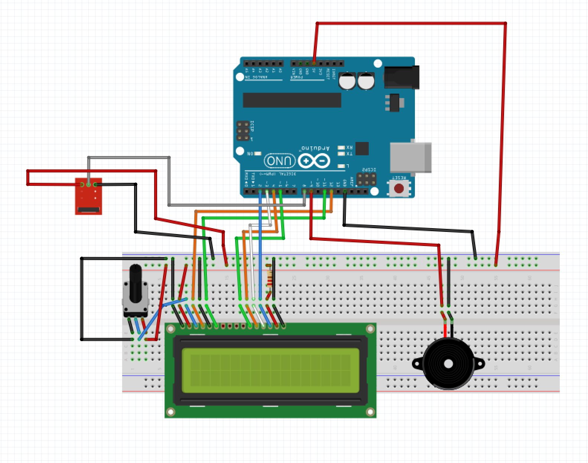

# Coda
Coda is a wireless instrument that is capable of playing an octave of notes ranging from C7-C8 on a piano. The Arduino device uses an IR remote as an input which sends button press signals to an IR receiver. The receiver processes the data, and outputs appropriate noises on the buzzer, and tells the user what note is playing on an LCD screen.

https://user-images.githubusercontent.com/67641046/141696208-acd9c9f9-8512-40ea-952a-cbd663f78634.mp4

## Design

In the schematic above, the red device is the IR tranceiver, connected to an Arduino UNO. The rest of the devices are connected to the Arduino and the breadboard, from left to right, the components include a potentiometer, 16x2 LCD screen, and a passive buzzer.

## Documentation
File | Contents
---- | --------
`Datasheets/IR Remote Control.pdf` | IR remote control datasheet.
`Libraries/IRremote.zip` | IR remote Arduino library.
`Datasheets/LCD1602A LCD Display.pdf` | 16x2 LCD screen datasheet.
`Datasheets/Passive buzzer.pdf` | Passive buzzer datasheet.
`Misc/Schematic.png` | Electrical wiring schematic for Arduino.
`Misc/Wireless_Instrument_Demo.mp4` | Demonstration video.
